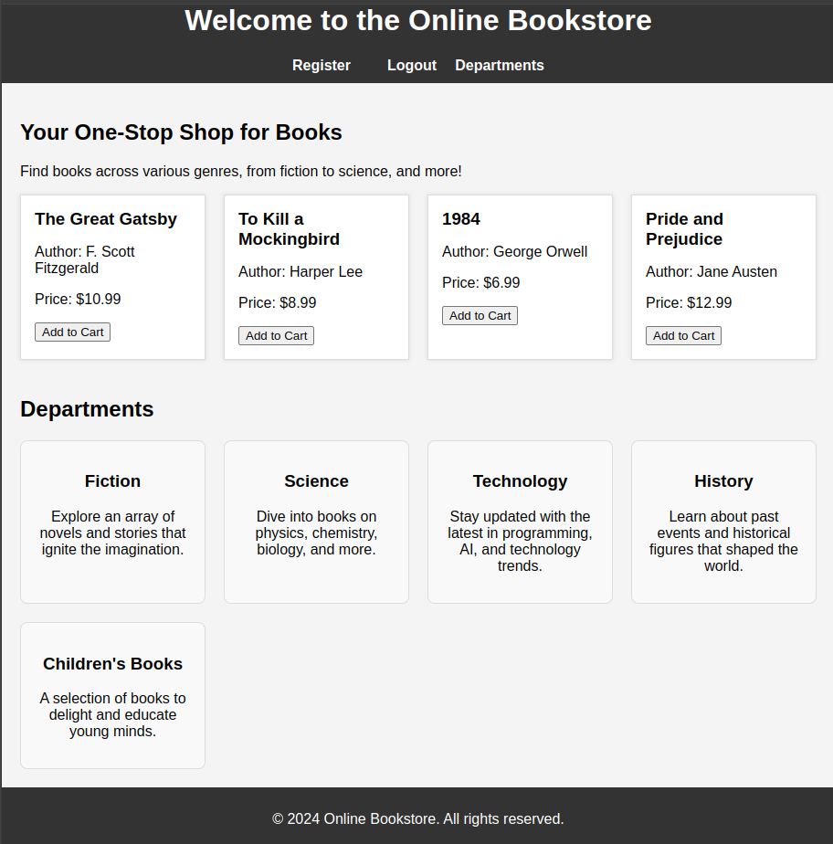

# Online Bookstore

Welcome to the Online Bookstore! This project provides an easy-to-use platform where users can explore a variety of books from different genres such as Fiction, Science, Technology, History, and Children's Books. Users can register, log in, view available books, and add them to their cart.

## Features

- **User Authentication**: Register, login, and logout functionality.
- **Book Categories**: Browse books across various departments like Fiction, Science, Technology, History, and Children's Books.
- **Cart Functionality**: Add books to the cart if logged in.
- **Dynamic Book Listing**: Books are dynamically fetched and displayed from the backend.
  
## Technologies Used

- **Frontend**: HTML, CSS, JavaScript
- **Backend**: Flask (Python)
- **Authentication**: User login and session management
- **Data Storage**: JSON for book data
- **Libraries**: Fetch API for dynamic content loading

## Setup

1. Clone the repository:

    ```bash
    git clone https://github.com/yourusername/online-bookstore.git
    ```

2. Navigate to the project directory:

    ```bash
    cd online-bookstore
    ```

3. Install the required dependencies for the backend:

    ```bash
    pip install -r requirements.txt
    ```

4. Run the Flask backend:

    ```bash
    python app.py
    ```

5. Open `index.html` in your browser to start using the bookstore.

## Screenshots



> A screenshot of the Online Bookstore homepage.

## Contributing

Contributions are welcome! If you have any suggestions or improvements, feel free to open an issue or create a pull request.

## License

This project is licensed under the MIT License - see the [LICENSE](LICENSE) file for details.
